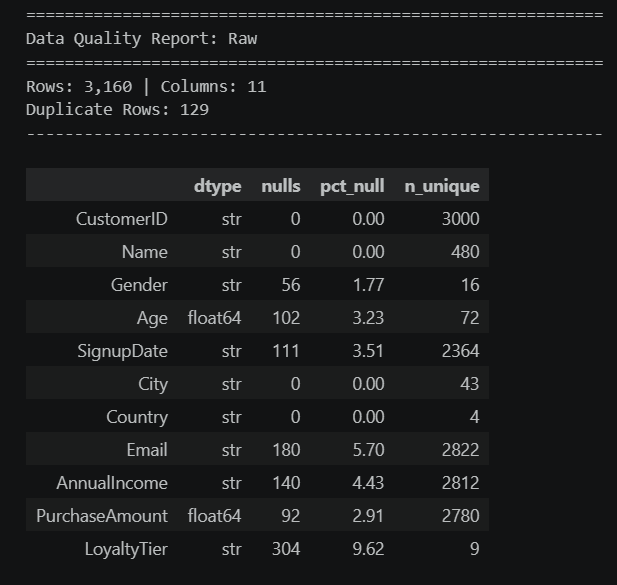
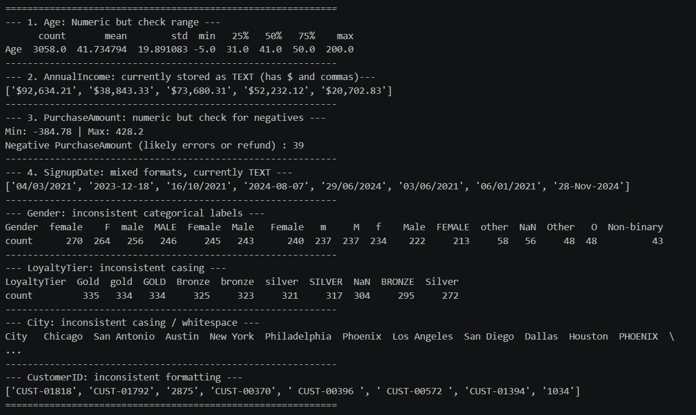
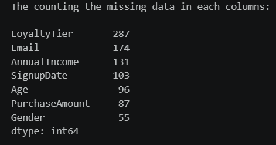
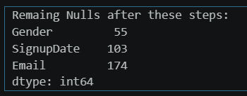
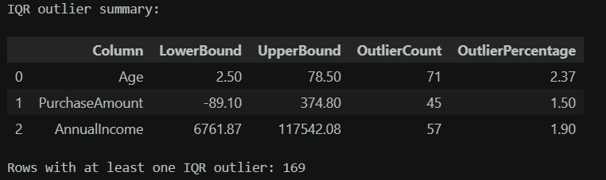
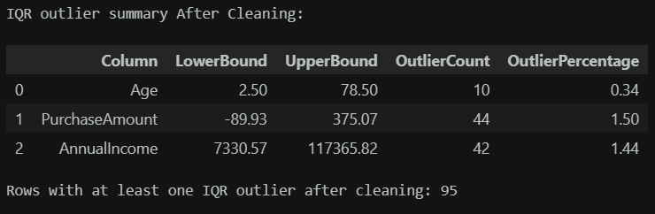
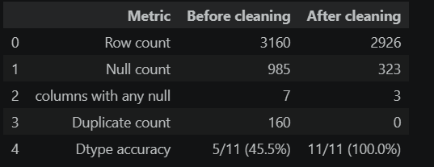

# Data Cleaning: Messy Customer Dataset

This project cleans a deliberately inconsistent customer and transaction
dataset with Python and pandas. The complete, documented workflow is in
[`notebook/Cleaning_Data.ipynb`](notebook/Cleaning_Data.ipynb).

## Project structure

```text
DataAnalytics-L1-CleaningData/
├── data/
│   ├── raw/
│   │   └── messy_customer_data.csv
│   └── cleaned/
│       └── cleaned_customer_data.csv
├── notebook/
│   └── Cleaning_Data.ipynb
├── screenshots/
│   ├── before_after_summary.png
│   ├── data_quality_finding_raw.png
│   ├── data_quality_report.png
│   ├── IQR_outlier_summary_after_cleanup.png
│   ├── IQR_outlier_summary_before_cleanup.png
│   ├── missing_data_counts_after_cleanup.png
│   └── missing_data_counts_before_cleanup.png
└── README.md
```

The raw dataset is kept unchanged, while the cleaned result is written to the
`data/cleaned/` directory.

## Main takeaway

Data cleaning is more than removing empty rows. This project shows that a
dataset can look usable while still containing duplicate records, inconsistent
formats, invalid values, and misleading data types. A documented,
column-specific cleaning process produces a more reliable dataset for analysis
while preserving information that should not be guessed or discarded.

## What was found

The notebook identified the following issues in the raw customer dataset:

- Missing values were present in `Age`, `SignupDate`, `Email`, `AnnualIncome`,
   `PurchaseAmount`, and `LoyaltyTier`.
- `AnnualIncome` was stored as text with currency symbols and commas, while
   `SignupDate` contained multiple date formats.
- `Gender`, `LoyaltyTier`, and `City` contained inconsistent casing,
   whitespace, or abbreviations.
- `CustomerID` values used mixed formats, including bare numbers and prefixed
   IDs.
- Exact duplicates and near-duplicates existed in the data.
- Numeric anomalies included impossible ages, extreme or negative income
   values, and negative purchase amounts that may represent refunds or entry
   errors.

The cleaning decisions were deliberately targeted: numeric missing values were
filled with medians, missing loyalty tiers with the mode, while missing emails
and signup dates were retained as null because they cannot be inferred
reliably. Impossible ages and negative incomes were removed, and negative
purchase amounts were retained with a review flag rather than silently changed.

The final output has standardized labels and identifiers, parsed dates,
analysis-ready numeric fields, corrected data types, and an auditable record of
the transformations applied.

## Cleaning workflow

The notebook performs the following steps:

1. Loads the raw CSV and creates a data-quality report.
2. Removes exact duplicate rows.
3. Standardizes categorical values in `Gender` and `LoyaltyTier`.
4. Normalizes city names and formats every `CustomerID` as `CUST-#####`.
5. Parses mixed `SignupDate` formats into a datetime column.
6. Removes near-duplicates using `CustomerID`, `Name`, and `SignupDate`.
7. Handles missing values with documented, column-specific strategies:
   median imputation for numeric fields, mode imputation for `LoyaltyTier`,
   and intentional null retention for fields such as `Email` and `SignupDate`.
8. Detects numeric outliers with the IQR method, removes impossible ages and
   incomes, and flags negative purchase amounts for review.
9. Corrects data types and rounds currency fields to two decimal places.
10. Compares data quality before and after cleaning and saves the result.

## Results and screenshots

The notebook includes visual outputs that document the effect of the cleaning
process:

### Data quality report



### Raw data quality findings



### Missing data before and after cleaning

| Before cleaning | After cleaning |
|---|---|
|  |  |

### IQR outliers before and after cleaning

| Before cleaning | After cleaning |
|---|---|
|  |  |

### Before-and-after summary



## Requirements

- Python 3.x
- Jupyter Notebook or JupyterLab
- pandas
- NumPy

Install the dependencies with:

```bash
pip install pandas numpy jupyter
```

## Run the notebook

From this project directory, start Jupyter:

```bash
jupyter notebook
```

Open `notebook/Cleaning_Data.ipynb` and run the cells from top to bottom. The
cleaned file will be generated at:

```text
data/cleaned/cleaned_customer_data.csv
```

Running the notebook in order is important because later sections use the
cleaned dataframe created by earlier cells.
